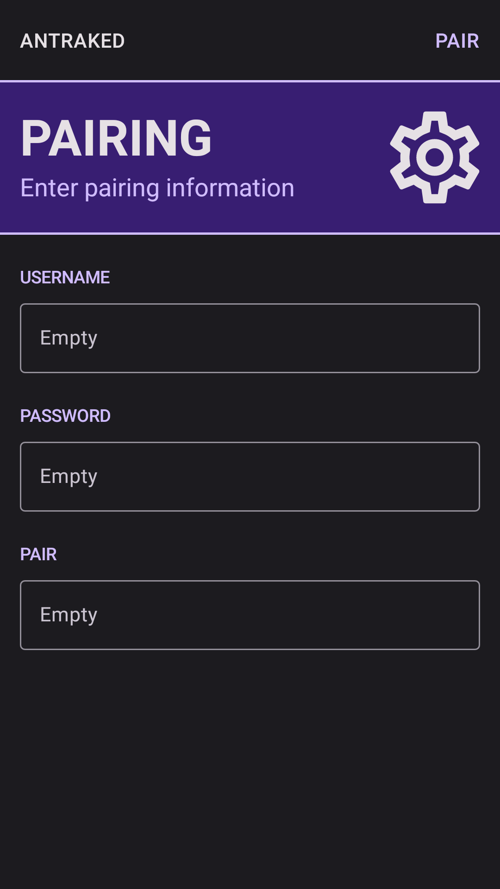
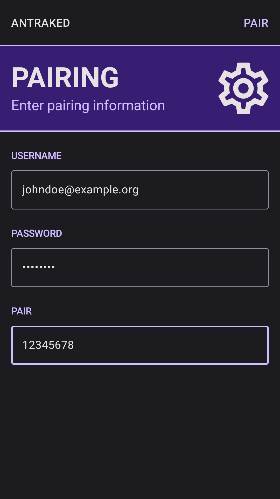
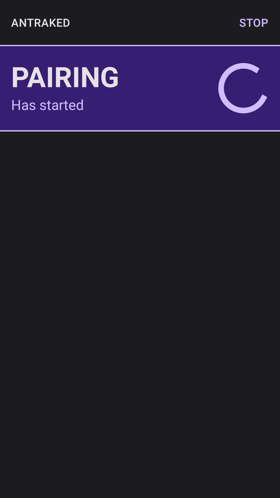
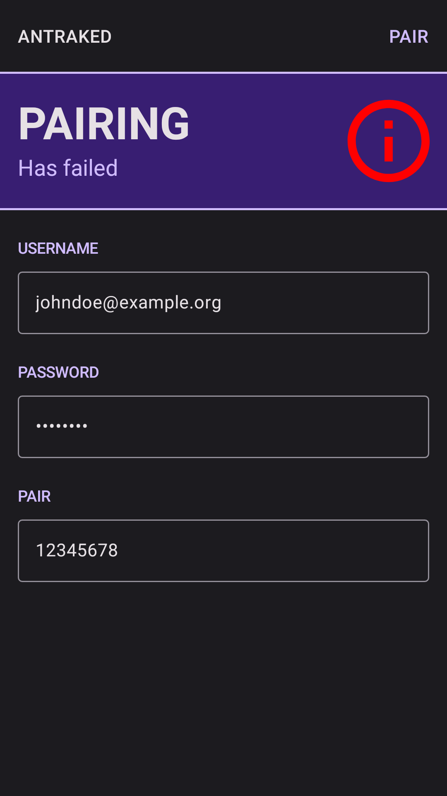

# <samp>OVERVIEW<samp>

Android example using flows and webview.



# <samp>DONATION</samp>

Support my work by sending me some crypto.

```txt
ADA: xxxxxxxxxxxxxxxxxxxxxxxxxxxxxxxxxxxxxxxxxxxxxxxxxxxxxxxxxxxxxxxxxxxxxxxxxxxxxxxxxxxxxxxxxxxxxxxxxxxxxxx
BCH: xxxxxxxxxxxxxxxxxxxxxxxxxxxxxxxxxxxxxxxxxx
BTC: xxxxxxxxxxxxxxxxxxxxxxxxxxxxxxxxxxxxxxxxxx
ETH: xxxxxxxxxxxxxxxxxxxxxxxxxxxxxxxxxxxxxxxxxx
XMR: xxxxxxxxxxxxxxxxxxxxxxxxxxxxxxxxxxxxxxxxxxxxxxxxxxxxxxxxxxxxxxxxxxxxxxxxxxxxxxxxxxxxxxxxxxxxxxx
```